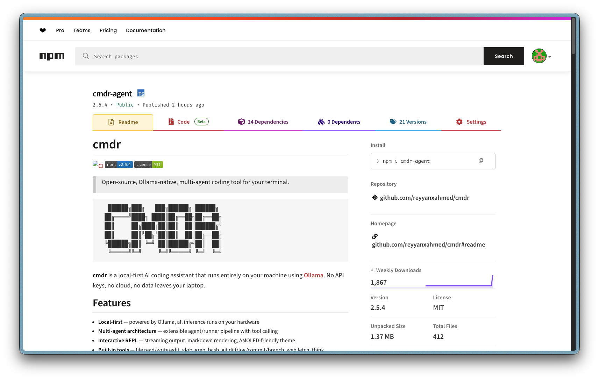
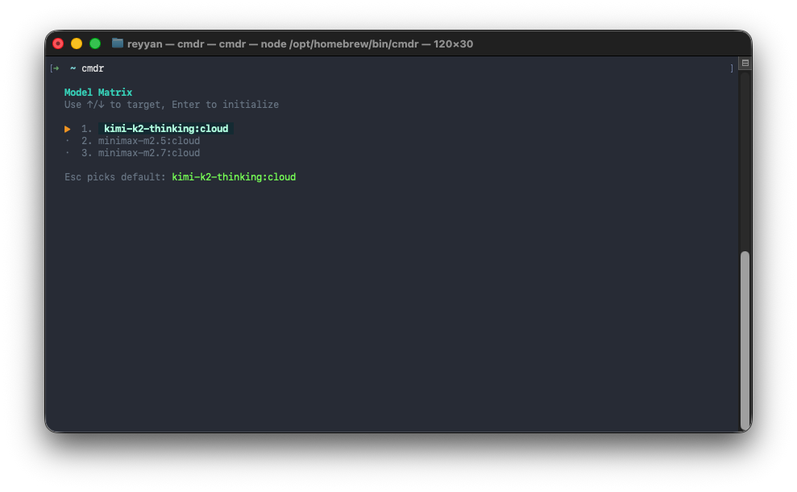
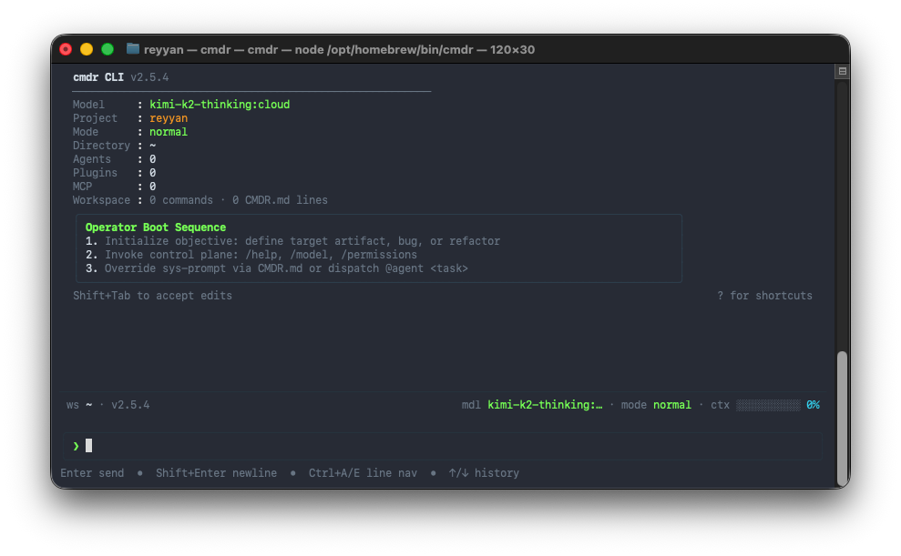
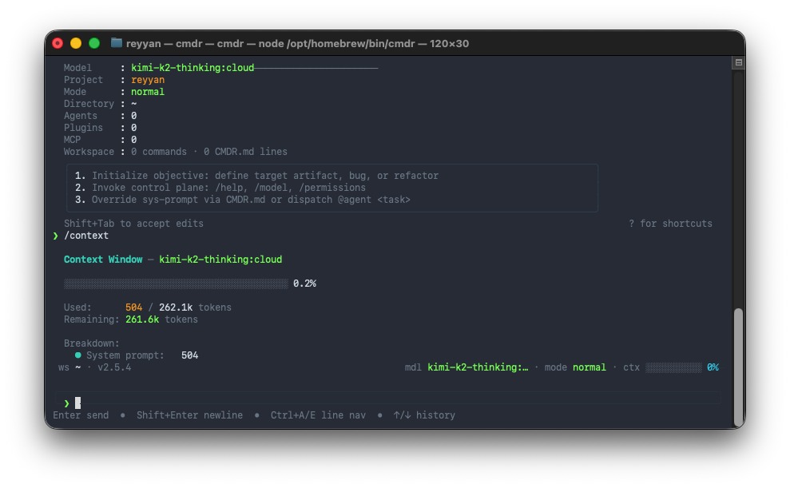

<div align="center">

```
   ██████╗███╗   ███╗██████╗ ██████╗ 
  ██╔════╝████╗ ████║██╔══██╗██╔══██╗
  ██║     ██╔████╔██║██║  ██║██████╔╝
  ██║     ██║╚██╔╝██║██║  ██║██╔══██╗
  ╚██████╗██║ ╚═╝ ██║██████╔╝██║  ██║
   ╚═════╝╚═╝     ╚═╝╚═════╝ ╚═╝  ╚═╝
```

**Local-first, multi-agent AI coding in your terminal.**

[](https://github.com/reyyanxahmed/cmdr/actions/workflows/ci.yml)
[](https://www.npmjs.com/package/cmdr-agent)
[](https://www.npmjs.com/package/cmdr-agent)
[](https://github.com/reyyanxahmed/cmdr)
[](https://github.com/reyyanxahmed/cmdr)
[](LICENSE)

[Getting Started](docs/getting-started.md) · [Usage](docs/usage.md) · [Configuration](docs/configuration.md) · [Benchmarks](docs/benchmarks.md)

</div>

---

## What is cmdr?

**cmdr** is an AI coding assistant that runs **entirely on your machine** using [Ollama](https://ollama.ai). No API keys, no cloud, no data leaves your laptop.

```bash
npm install -g cmdr-agent
cmdr
```

## Contents

- [Screenshots](#screenshots)
- [Highlights](#highlights)
- [Quick Start](#quick-start)
- [Documentation](#documentation)
- [Contributing](#contributing)
- [License](#license)

## Screenshots

<p align="center">
  
  <br>
  <em>Published on npm with 1,800+ weekly downloads</em>
</p>

<details>
<summary><strong>More screenshots</strong></summary>
<br>

<p align="center">
  
  <br>
  <em>Interactive model picker — choose from your locally available Ollama models on startup</em>
</p>

<p align="center">
  
  <br>
  <em>Session dashboard with model info, permission mode, status bar, and operator boot sequence</em>
</p>

<p align="center">
  
  <br>
  <em>Real-time context window tracking — see token usage, remaining capacity, and per-component breakdown</em>
</p>

</details>

## Highlights

| | Feature | |
|---|---|---|
| 🔒 | **Local-first** | All inference on your hardware via Ollama |
| 🤖 | **Multi-agent teams** | Code review, full-stack, security audit presets |
| 🛠 | **13 built-in tools** | Files, grep, glob, bash, git, web fetch, think |
| ✅ | **Human-in-the-loop** | Approve, deny, or always-allow each tool call |
| 🧠 | **Context compaction** | Multi-stage strategy keeps long conversations in bounds |
| 🔌 | **Plugins & MCP** | Extend with npm modules or Model Context Protocol servers |
| 💾 | **Session persistence** | Auto-save, resume, `--continue` |
| ↩️ | **Undo** | `/undo` reverts any file change the agent made |
| 📊 | **Token tracking** | `/cost` for per-session usage breakdown |
| 📁 | **Project awareness** | Reads `CMDR.md` for project-specific instructions |

## Quick Start

```bash
# 1. Install Ollama — https://ollama.ai
ollama pull qwen3-coder:latest

# 2. Install cmdr
npm install -g cmdr-agent

# 3. Go
cmdr
```

```bash
# One-shot mode
cmdr "fix the failing tests"

# Pick a model
cmdr -m llama3.1:8b

# Multi-agent review
cmdr --team review
```

## Documentation

| Page | Description |
|------|-------------|
| [Getting Started](docs/getting-started.md) | Installation, first run, verify |
| [Usage](docs/usage.md) | CLI flags, slash commands, built-in tools |
| [Multi-Agent Teams](docs/multi-agent.md) | Team presets and orchestration |
| [Plugins & MCP](docs/plugins.md) | Plugin system and MCP integration |
| [Configuration](docs/configuration.md) | Config files, env vars, permissions, CMDR.md |
| [Benchmarks](docs/benchmarks.md) | Eval suite and HumanEval results |
| [Architecture](docs/architecture.md) | Project structure and development setup |

## Contributing

See [CONTRIBUTING.md](CONTRIBUTING.md).

## License

[MIT](LICENSE) — Reyyan Ahmed
