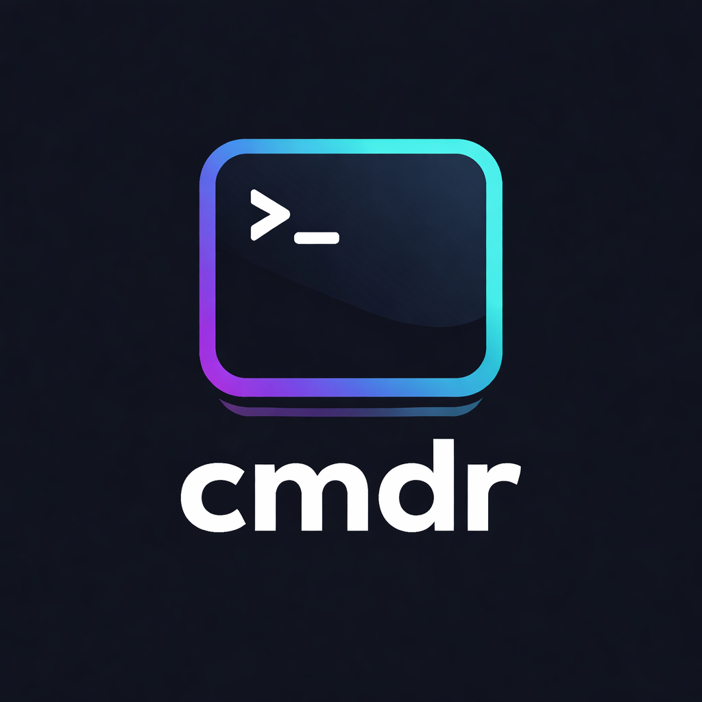

<p align="center">
  
</p>

<h1 align="center">cmdr</h1>

<p align="center">
  <strong>Local-first AI coding assistant for VS Code.</strong><br/>
  Your models. Your machine. Your data.
</p>

<p align="center">
  <a href="https://github.com/reyyanxahmed/cmdr">GitHub</a> ·
  <a href="https://ollama.ai">Ollama</a> ·
  <a href="https://www.npmjs.com/package/cmdr-agent">npm</a>
</p>

---

cmdr brings local AI coding assistance directly into VS Code — no cloud, no API keys, no data leaving your machine. Powered by [Ollama](https://ollama.ai) and the [cmdr](https://github.com/reyyanxahmed/cmdr) agent framework.

## Features

- **`@cmdr` Chat Participant** — Ask questions, generate code, and get help right inside VS Code's built-in chat panel
- **Inline Completions** — Real-time AI code suggestions as you type, powered by Ollama's fill-in-the-middle (FIM) models
- **Smart Code Actions** — Fix errors, explain code, refactor, and write tests from the lightbulb menu or command palette
- **Code Review** — Get AI-powered review of your uncommitted git changes
- **Multi-Model Support** — Switch between any Ollama model on the fly
- **Zero Config** — Auto-starts `cmdr serve` in the background; just install and go

## Requirements

- [Ollama](https://ollama.ai) installed and running locally
- [cmdr](https://www.npmjs.com/package/cmdr-agent) installed globally:
  ```sh
  npm install -g cmdr-agent
  ```

## Quick Start

1. Install Ollama and pull a model:
   ```sh
   ollama pull qwen3-coder:latest
   ```
2. Install cmdr:
   ```sh
   npm install -g cmdr-agent
   ```
3. Install this extension from the VS Code Marketplace
4. Open any project — the extension auto-starts `cmdr serve` in the background
5. Use `@cmdr` in the chat panel or run commands from the palette

## Settings

| Setting | Default | Description |
|---------|---------|-------------|
| `cmdr.model` | `qwen3-coder` | Model for chat and code actions |
| `cmdr.completionModel` | `qwen2.5-coder:7b` | Model for inline completions |
| `cmdr.effort` | `medium` | Effort level (low / medium / high / max) |
| `cmdr.ollamaUrl` | `http://localhost:11434` | Ollama server URL |
| `cmdr.inlineCompletions` | `true` | Enable inline completions |
| `cmdr.autoStart` | `true` | Auto-start cmdr serve |
| `cmdr.port` | `4200` | Server port |

## Commands

| Command | Description |
|---------|-------------|
| `cmdr: Open Chat` | Open the `@cmdr` chat panel |
| `cmdr: Explain Selection` | Explain the selected code |
| `cmdr: Refactor Selection` | Refactor the selected code |
| `cmdr: Write Tests` | Generate tests for selected code |
| `cmdr: Fix Error` | Fix diagnostics in the current file |
| `cmdr: Review Changes` | AI review of uncommitted git changes |
| `cmdr: Switch Model` | Change the active Ollama model |

## Why cmdr?

- **100% Local** — Everything runs on your machine. No telemetry, no cloud calls.
- **Open Source** — MIT licensed. Fork it, extend it, make it yours.
- **Fast** — Lightweight extension that connects to a local cmdr server.
- **Model Agnostic** — Use any model Ollama supports: Qwen, Llama, DeepSeek, Gemma, and more.

## License

This extension is licensed under the [MIT License](LICENSE).
